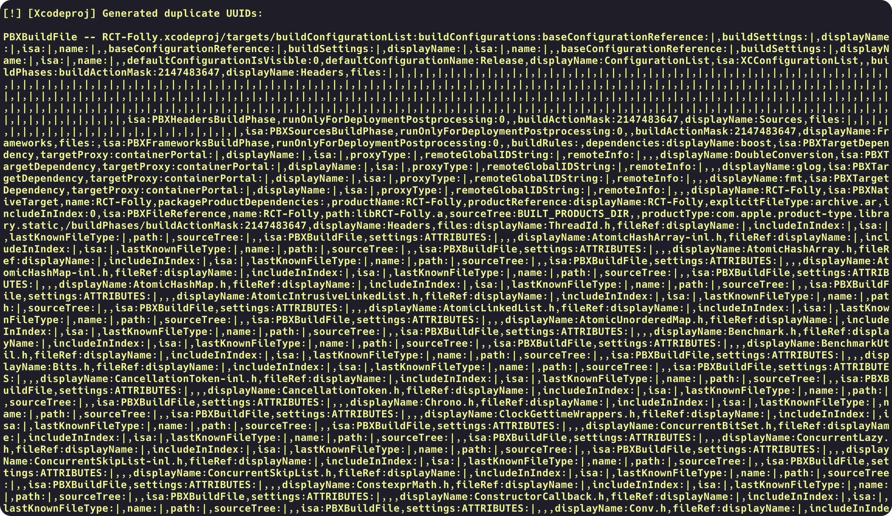
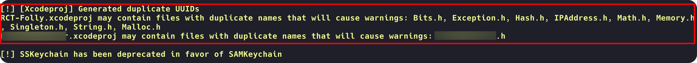

# OverrideDuplicateUUIDsWarning
Override warning "[Xcodeproj] Generated duplicate UUIDs" after pod install, resolve the problem of long long terminal log

This script will rewrite the log of the "**Generated duplicate UUIDs**" warning, extracting key information and significantly shortening the terminal log of pod install

## Compare

### Before

### After

## Usage

1. Move `override_duplicate_UUIDs_warning.rb` to your project dir
2. Require it in the `Podfile`
3. Continue your `pod install`

## Why is there this warning?

After my attempts, the reason for this warning is a duplicate file in this xcodeproj, but I haven't found a root cause for the "duplicate UUIDs" problem, but if you have this warning in your local pod, try to find the duplicate file in your local pod project.

## Something

The purpose of this script is not to resolve the root cause of the warning, but to resolve the large number of warnings output by pod install and to extract key information to assist the relevant developers in resolving them.

Also, in my project, RCT-Folly is one of the components that shows this warning, and I can't fix it at the root cause, only avoid the warning from affecting me.
